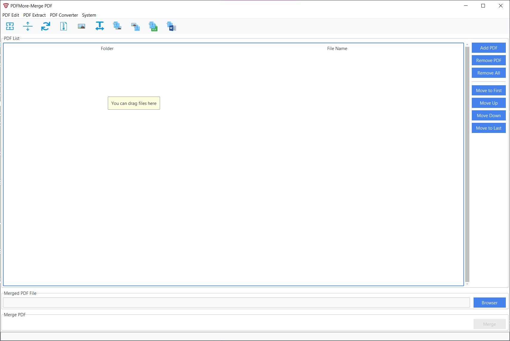
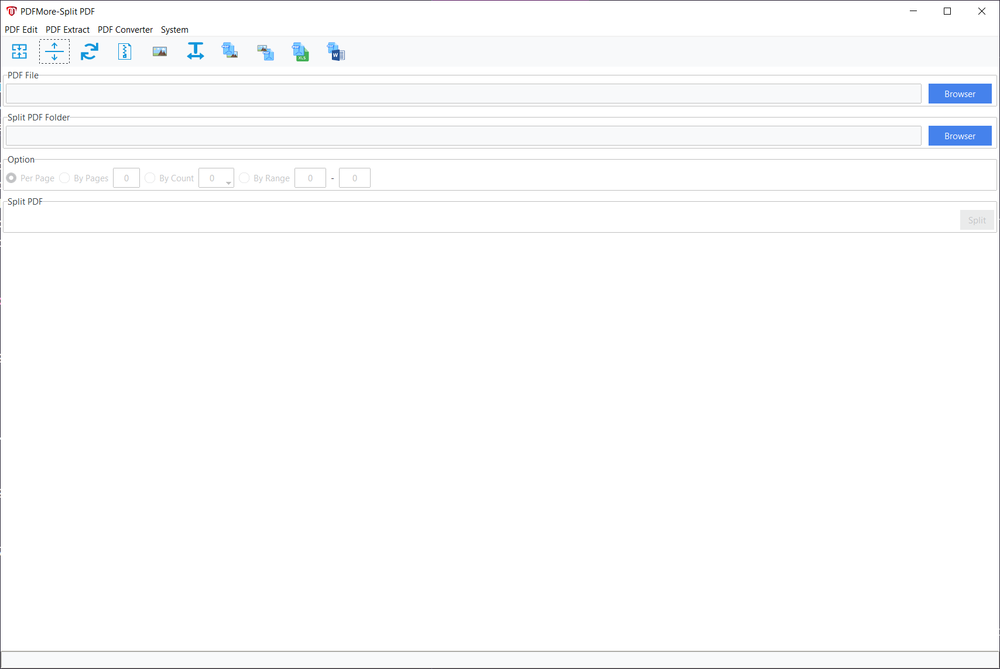

# PDFMore


**PDFMore**, an application used to operate PDF, wrote by using Python. Based on ttkbootstrap, it looks more beautiful rather than traditional tk/ttk style. The project is based on the project [PDFeXpress](https://github.com/chianjin/PDFeXpress)






## Developing Environment

- Python 3.9.13
- ordered-set==4.1.0
- Pillow==9.4.0
- psutil==5.9.1
- PyMuPDF==1.20.2
- ttkbootstrap==1.9.0
- pdfplumber==0.7.4
- openpyxl==3.0.10
- tkinterdnd2==0.3.0
- pdf2docx==0.5.6
- numpy==1.24.1
- opencv-python==4.7.0.68

## Current Version

The current version is 1.0.0-Release, tested on Windows 7 , 10 and 11. 

## Main Functions

- **Merge**: Merge multiple PDF files into one PDF
- **Split**: Splits a PDF into multiple PDFs, supporting single page splitting, split by number of pages, by number of
  copies, and by range
- **Rotate** : Rotate each PDF page with 90° clockwise, counterclockwise, and 180°
- **Compression**: Reduces PDF file size by compressing the images contained in the page
- **Extract Images**: Extracts the images contained in the PDF file and saves them in the original data format
- **Extract Text**: Extracts plain text contained in a PDF file, without formatting
- **PDF to Image** : Converts each entire pages of a PDF file to images
- **Image to PDF**: Converts images file to PDF.

- **PDF to DOCX**: Converts PDF to docx file.
- **PDF to EXCEL**: Converts/Extracts table and then write to excel file from PDF files.


## Running Method

There are two type binary, installer and portable packages. [Download](https://github.com/HoxinhLuo/PDFMore/releases)
and install or unzip it, run `PDFMore.exe`.

## Build

If you want to build the application yourself. Please follow these steps below(You need to install pyinstaller first). And virtual python environment recommend:

```shell
> git clone https://github.com/HoxinhLuo/PDFMore.git
> cd PDFMore
> pip install -r requirements.txt
> python build_pyinstaller.py
```

The compiled binary package and installer are saved in `release` folder.
