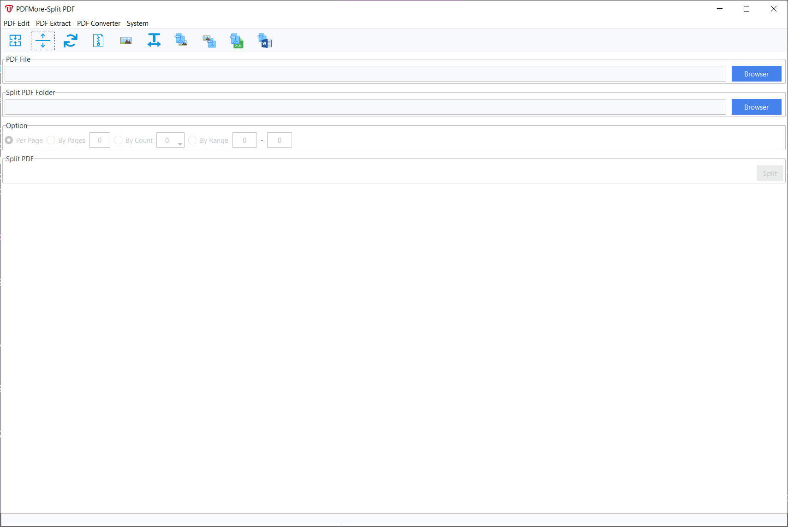

# PDFMore

[[English]](https://github.com/HoxinhLuo/PDFMore/blob/main/README.md)  [[简体中文]](https://github.com/HoxinhLuo/PDFMore/blob/main/README_zh.md)


**PDFMore**, 是一个用来操作PDF的应用程序，用Python编写的。
基于ttkbootstrap，它看起来比传统的tk/ttk风格更漂亮和美观。
项目是以项目[PDFeXpress](https://github.com/chianjin/PDFeXpress)为基础进行创建和开发的。





## 开发环境

- Python 3.9.13
- ordered-set==4.1.0
- Pillow==9.4.0
- psutil==5.9.1
- PyMuPDF==1.20.2
- ttkbootstrap==1.9.0
- pdfplumber==0.7.4
- openpyxl==3.0.10
- tkinterdnd2==0.3.0
- pdf2docx==0.5.6
- numpy==1.24.1
- opencv-python==4.7.0.68

## 当前版本

当前的版本是1.0.0-Release，在Windows 7、10和11上进行了测试。

## 主要功能

- **合并**: 将多个PDF文件合并为一个PDF
- **分割**: 将PDF分割为多个PDF，支持单页分割、按页数分割、按份数分割以及按范围分割
- **旋转** : 将PDF页面顺时针、逆时针旋转90°，以及旋转180°
- **压缩**: 通过压缩页面所包含的图像，减小PDF文件大小
- **提取图像**: 提取PDF文件所包含的图像，按照原始数据格式保存
- **提取文本**: 提取PDF文件所包含的纯文本，不包含格式
- **PDF转换为图像** : 把PDF文件整个页面转换为图像
- **图像转换为PDF**: 把图像文件转换为PDF
- **PDF转成WORD**: 将PDF转换为Word文件
- **PDF转成EXCEL**: 从PDF文件转换/提取表格，然后写入EXCEL文件


## 运行方式

有两种形式的预编译包，安装包和绿色包，[下载](https://github.com/HoxinhLuo/PDFMore/releases) 、安装或解压，运行 `PDFMore.exe`.

## 构建

如果你打算自行构建可执行文件，按照以下步骤操作(你需要先安装pyinstaller). 推荐使用python虚拟环境:

```shell
> git clone https://github.com/HoxinhLuo/PDFMore.git
> cd PDFMore
> pip install -r requirements.txt
> python build_pyinstaller.py
```

预编译包安装程序保存在 `release` 目录中。
